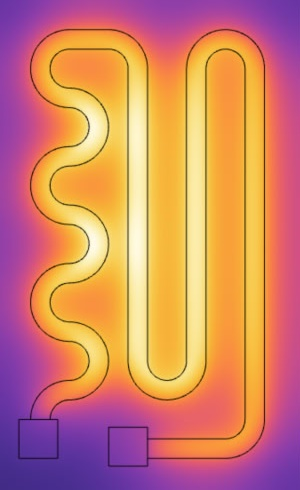
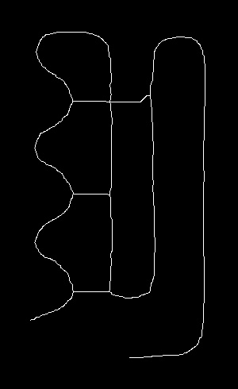
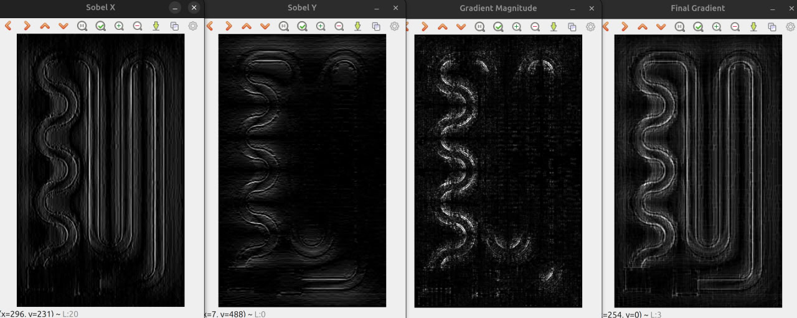
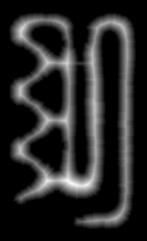

# Analyzing-thermal-photos
This project is a computer vision research paper on "Algorithm for quality control of electric film heaters for spacecraft using thermal imaging and camera data"

The main folder “C++” contains scripts with basic logic of image processing. Python_utils includes research part and various tests. Multiphysics contains a model of the heater to obtain synthetic data on which the algorithm is further tested.

Initial tuning of the algorithm was performed based on this image:

Several important stages are highlighted:
1. processing of a 16-bit dual channel image from a thermal imaging photo
2. Preprocessing, binarization by local boundaries obtained from gradient map
2* DFS for mask labeling and resistive layer gap verification
3. Distance map calculation (+testing Zhang-Suen thinning algorithm)
4. Local maxima extraction - final skeletonization
5. Obtaining conclusions based on the skeleton dispersion with respect to the heater mask

It's a straightforward algorithm. 
It is also realized to obtain thermal photo based on digital photo.

